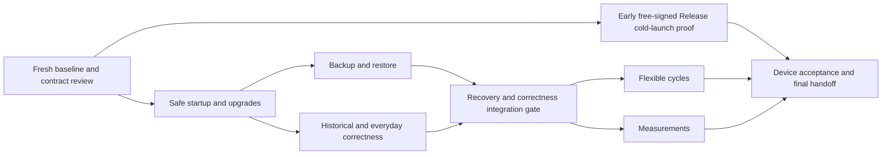

> **Document status:** partially implemented, then superseded. Cycle wrap-up, backup/restore, and daily weight later shipped in different form; custom cycle dates, calories, CSV export, and the ten-year scale programme were never built as specified here. Retained as historical context, not as a current description of the app.

> MVP scope update (2026-09-08): [Final MVP implementation plan](mvp-final-implementation-plan.md) is authoritative for remaining work: cycle wrap-up and durable backup/restore. Broader M11–M16 requirements and old handoffs are deferred unless explicitly included there. Historical implementation evidence below remains valid.

# Hexis completion objective and delivery plan

**Status:** Originally approved direction; this document no longer describes remaining work. See the document status line above.  
**Plan date:** 2026-09-06.  
**Scope:** M11–M16, following the existing M0–M10 implementation.  
**Owner decision:** Use a free Apple ID. Renew the personal-device installation every seven days. A paid developer membership is not required or desired.

## 1. Objective and authority

Finish Hexis as dependable, local-first personal iPhone infrastructure for finite practice cycles and optional daily weight/calorie logging. The end state must preserve years of history, adapt to ordinary routine changes without code edits, work offline, and provide demonstrated backup, recovery, upgrade, and installation procedures.

This is a finite delivery contract, not an invitation to build a general habit, fitness, or nutrition platform. Finish all required milestones, document acceptance, and stop mandatory feature development. P2 and Future work do not prevent completion.

This document is the authoritative product and delivery specification for **M11–M16**. It supersedes conflicting assumptions in the older plans concerning fixed cycle lengths, historical calculation rules, data recovery, and completion criteria. The older [implementation plan](implementation-plan.md), [parallel delivery plan](parallel-delivery-plan.md), and progress entries remain evidence for M0–M10; do not restart completed work or execute their old task lists as new requirements. The user's subsequent instructions take precedence over this document.

Creating this plan does not claim that any feature below has been implemented. Implementing agents must inspect current code, account for concurrent changes, and verify each acceptance criterion. Do not manufacture device results or mark an implemented milestone accepted while device checks are pending.

### Product principles

- Calm, direct logging of actual effort; no overdue-task administration.
- Finite commitments, a deliberately small practice set, and descriptive insights.
- SQLite is the runtime source of truth. No account, backend, or internet connection is required for ordinary use.
- Changes to future plans must not silently rewrite earlier facts or commitments.
- Explicit corrections may change derived historical totals; their original records and correction history remain preserved.
- Small, understandable mechanisms take priority over generalized frameworks.

### What self-contained means

1. A successful save survives relaunch; failed actions retain existing history and give an understandable next action.
2. The owner can configure cycles and the two supported measurement logs through the UI.
3. The app cold-launches and functions without Metro, a running Mac, or a network connection while its provisioning remains valid.
4. A valid external backup reconstructs all personal data in a clean installation; readable exports remain useful without Hexis.
5. Upgrades preserve records or leave a recoverable state with the prior data available.
6. Essential accessibility, years-scale performance, and installation/restore procedures are demonstrated on an iPhone.
7. Normal upkeep is limited to accepted signing renewal, backups, and occasional platform/defect maintenance.

### Accepted maintenance boundary

The owner explicitly accepts free personal provisioning and renewal every seven days. This is an accepted operational cost, **not a product defect or unfinished milestone**. Do not propose paid membership, TestFlight, or App Store distribution as a completion dependency.

Use a standalone **Release configuration signed for personal-device development**, not a Debug build that depends on Metro. Release configuration and paid distribution are different concerns. Verify the actual toolchain and device behavior before documenting success.

Routine renewal means reprovisioning/rebuilding and installing **over the existing app with the same bundle identifier and signing identity**. It does not mean deleting the app first. Deletion/reinstallation is a separate destructive recovery scenario, tested only with disposable data and a verified external backup. Do not promise that every reinstall or signing-team change preserves the sandbox.

## 2. Repository baseline and known gaps

The planning review inspected implementation, schema, migrations, tests, and documentation. It did not perform a new physical-iPhone or screenshot-based accessibility audit.

| Area | Confirmed implementation | Remaining work |
| --- | --- | --- |
| Habits | Setup, direct logging/details/undo, historical add/edit/delete, dashboard, Day/Week/Cycle history | Correctness, error paths, and device acceptance below |
| History storage | Immutable session bases, append-only revisions/tombstones, dated practice membership and configuration | Consistent interpretation, forward-only write guards, restoration of deleted activities |
| Cycles | Natural completion, early ending, archive, repeat setup | Custom dates, active name/end edits, planned/actual separation |
| Duration | 30/60/90 in UI, TypeScript, and SQLite CHECK | A schema and consumer change, not just another picker option |
| Database | WAL, foreign keys, V1–V6 per-migration transactions, one-active-cycle unique index | Safe startup, supported-version guard, snapshots, integrity checks, interrupted-upgrade recovery |
| Backup/portability | No user backup/import/export/restore system found | Complete recovery and readable export |
| Measurements | No weight/calorie feature found | Entire bounded measurement flow |
| Reminders | Optional local daily reminder and permission flow | Failure reconciliation and foreground/permission refresh |
| Verification | Meaningful domain/component/SQLite-backed mock tests | Native file failures, accessibility, long-history/device evidence |
| Installation | Previously confirmed signed personal Debug development loop | Free-signed standalone Release and data-preserving weekly renewal |

### Source map

| Responsibility | Existing files to inspect |
| --- | --- |
| Database bootstrap/schema | `src/db/client.ts`, `DatabaseProvider.tsx`, `migrations.ts`, `schema.ts`, `app/_layout.tsx` |
| Cycle writes and lifecycle | `src/features/cycles/data/cycleRepository.ts`, `domain/types.ts`, `cycleLifecycle.ts`, `date.ts` |
| Goal changes and membership | `src/features/goals/data/goalRepository.ts`, `src/features/cycles/domain/goalMembership.ts`, goal editor routes |
| Summaries | `cycleProgress.ts`, `cycleSummary.ts`, `historyInsights.ts`, `homeDashboard.ts`, `cycleArchive.ts` under `src/features/cycles/domain/` |
| Session correction and time | `src/features/logging/data/sessionRepository.ts`, `domain/activityDateTime.ts`, `app/(tabs)/history.tsx` |
| Screen freshness | `useActiveCycle.ts`, `useCycleLanding.ts`, `useCycleHistory.ts`, and Home/History/Settings routes |
| Notifications | `src/features/reminders/reminderService.ts`, `app/(tabs)/settings/index.tsx` |
| Existing verification | `__tests__/db`, `data`, `domain`, `components`, `reminders`; `docs/release-checklist.md`; `progress/` |

### Findings to reproduce or close, not blindly reimplement

- History Week evaluates some target/configuration fields at Monday; Home and cycle trends/streaks can evaluate later configurations. A Wednesday change from three weekly sessions to two can produce contradictory met/missed results for the same two sessions.
- A database initialization error is retained by the provider but can leave consumers displaying initial loading. There is no complete recovery boundary.
- The migration loop does not explicitly reject a `user_version` newer than its supported list.
- Goal revision validation bounds dates to the cycle/membership but does not fully enforce the documented active/today-only rule at the repository boundary.
- Early ending replaces `end_date` but leaves the original `duration_days`; consumers can disagree about cycle bounds.
- Activity editing combines a stored reporting date with clock time in the current device timezone, then reconstructs the instant even for unrelated changes. Preserve original instant/date on non-time edits.
- Settings' active-cycle lookup is tied to database-reference changes, while navigation and foreground/date changes need explicit refresh. Some Settings actions lack caught failures or pending guards. Recheck current fixes before assigning work.
- Reminder OS scheduling and SQLite settings are separate operations and need reconciliation after partial failures.
- Calendar interactive cells are 22 points in the reviewed source. Source labels alone do not establish touch or VoiceOver usability.
- History currently loads every cycle's goals, revisions, and effective sessions to build its archive. Measure representative data before optimizing.
- The overview claims duration-only practices, but the model requires a positive session-count target and derives minutes from count times expected duration. Correct documentation; standalone minute-only targets are not added to this plan.
- An old milestone mentions a separate Week tab; actual navigation is Home/History/Settings.

The initial planning test run passed TypeScript and 230/231 tests across 30 suites. The sole failing repository test used an August fixture against the September wall clock; it passed with the clock fixed to August 23. By document creation, the working tree already contained a clock-fixing change to that test and changes to History/Settings/component tests. **These are historical review observations, not the implementation baseline or outstanding bugs by decree.** Run and record a fresh baseline from the actual integration commit. Preserve existing changes; do not reset, overwrite, or duplicate them.

The Expo SQLite mock is backed by SQLite and provides useful SQL coverage. It does not prove iPhone process interruption, file promotion, low storage, backup inclusion, or reinstall behavior.

## 3. Scope, priorities, and owner decisions

| Classification | Meaning |
| --- | --- |
| P0 | Required to trust and keep using Hexis: safe persistence/recovery, truthful summaries, dependable core actions, standalone installation |
| P1 | Required for the intended complete experience: flexible cycles, measurements, essential accessibility and maintenance handoff |
| P2 | Valuable but optional polish; never a release gate |
| Future | Explicitly deferred outside completion |

| Decision | Disposition |
| --- | --- |
| Installation | **Owner confirmed:** free Apple ID, seven-day renewal accepted. No paid-account requirement. |
| External backup frequency | **Planning default:** weekly, including before renewal/upgrades or any planned app deletion. Explain up to seven days of device-loss exposure if the routine is followed; overdue backups increase exposure. |
| Automatic cloud integration | Not required under the weekly manual-backup default. Reopen only if the owner explicitly requires a shorter off-device loss window that manual operation cannot meet. |
| Cycle model | Active/completed/ended_early only; adjustable plan, explicit actual closure, no pause/reopen. |
| Changed/short weeks | Raw effort with a neutral explanatory label; exclude affected practice-weeks from met/missed and target-normalized calculations. |
| Measurement multiplicity | One effective daily value per kind; additional entry edits that value, rather than sums calories or silently averages weight. |
| Measurement targets | P2, omitted from required delivery. |
| Platform | Support the owner's iPhone, with iOS 26+ as the intended product target. State the tested minimum explicitly; do not claim lower-iOS support merely because a generated deployment setting allows it. |

The backup interval is a recommendation carried forward from the roadmap, not a claim of a guaranteed cloud service or a separately confirmed owner preference. Implement the manual system without waiting on another planning question; explain its actual exposure at handoff. Changing that requirement must be an explicit scope decision, not an agent assumption.

### Explicit non-goals

Accounts, custom backends, full cloud sync, social features, leaderboards, AI coaching, payments/subscriptions, web/Android products, nutrition/workout planning, food databases, meals, barcodes, macros, calorie recommendations, timers, per-practice reminders, Apple Watch, widgets, HealthKit, arbitrary custom measurement definitions, pause/resume state machines, and restart-in-place.

P2 may include manually entered dated measurement reference targets, extra trend ranges, small shortcuts, or visual polish beyond required readability/accessibility. Leave these unimplemented unless separately requested. Do not add dependencies or schema complexity for speculative integrations.

## 4. Product and data contracts

These decisions must be shared across feature agents. Exact module names can adapt to repository conventions; observable behavior, invariants, compatibility, and acceptance criteria cannot be silently weakened.

### 4.1 Record identity, corrections, and writes

- Preserve stable cycle, practice, and source-activity identifiers through upgrades and restores.
- Base activities remain immutable. Edit, delete, undo, and restore append records. Normal reads expose the latest effective state; explicitly named audit reads expose all source/revision facts.
- Restore a deleted activity by appending a restoration revision, not by deleting its tombstone or rolling back the whole database. Restoring an existing historical fact must not masquerade as creating a new activity under today's membership rules.
- Every revision family has deterministic ordering. Do not depend solely on timestamps that can tie or move backward; preserve existing session revision sequence values and continuation behavior on restore.
- Use one small write coordinator and appropriately scoped SQLite transactions where needed. Reads/actions must not accidentally join unrelated async transactions. Test save/stop/end/restore overlap rather than assume a library helper guarantees isolation.
- Show success only after commit. Prevent duplicate submission while pending; preserve input on error. Retrying a completed operation after an uncertain result must not silently create duplicates.
- Read-only summaries remain derived; no duplicate authoritative scores or aggregates. Performance caches, if measured necessary, must be rebuildable from records.

### 4.2 Dates, timezones, and historical interpretation

- Cycle dates, membership dates, and measurement dates are local calendar dates (`YYYY-MM-DD`), not UTC-midnight timestamps. Use the shared date utilities and valid calendar arithmetic.
- Preserve a session's stored reporting date and UTC instant unless the user explicitly changes that field. Changing only duration or practice must preserve both, including seconds and precision.
- Capture entry-time timezone/offset context for new or explicitly time-corrected sessions if needed to render/edit their original local time. Legacy timezone metadata remains unknown; never derive a fictional original zone from the current phone's settings.
- Manual date/time entry is interpreted in an explicitly indicated zone, normally the current device zone. Reject nonexistent spring-forward times. For repeated fall-back times, resolve an explicit offset/occurrence consistently and disclose it before save; existing instants must remain unchanged on unrelated edits. No general timezone-management feature is required.
- Import preserves recorded dates/instants verbatim; changing devices or display units never rebuckets history.
- Revalidate the current local day, cycle state, membership, and action bounds at mutation time, not only when a form opens. Handle forms spanning midnight.
- Recompute derived current state on foreground return, navigation focus as appropriate, and local-day rollover while visible. No background server or timer is needed to finish cycles while the app is closed.
- Normal goal configuration/membership changes are active-cycle, today-effective operations. Historical activity corrections remain a separate authorized path. Migrations/restores may preserve valid legacy facts without exposing a general backdated-goal editor.

### 4.3 Weekly targets and streaks

Use Monday–Sunday everywhere. Implement a shared practice-week evaluation consumed by Home, History Week, Cycle insights, archive summaries, streaks, and exports.

1. Raw sessions/minutes always include valid effective activity inside the selected period and cycle bounds.
2. A fully included calendar week with full practice membership and a stable cadence/target configuration is eligible for target evaluation.
3. A week shortened by cycle boundaries, a midweek membership change, or a midweek target/cadence/expected-duration change is labelled with the reason and excluded from whole-week met/missed, remaining-target aggregates, and target-normalized ratios for that practice. Do not prorate flexible weekly targets or invent fractional sessions.
4. A name-only change does not invalidate target evaluation. Activity rows use the name effective on the activity date. Aggregate practice labels use the configuration at the selected period's bounded end/as-of date, consistently across screens.
5. For an in-progress otherwise eligible week, display progress and remaining effort; do not describe it as a missed commitment. If there are no eligible targets, use an unavailable/neutral state, not a misleading zero-percent success score.
6. Daily configuration remains inspectable on its effective date. This plan does not introduce new daily minimum-minute semantics or change count-target practices into task schedules.
7. Cadence changes start a new streak segment. Excluded/partial weekly units neither award nor penalize a scored week; break the displayed weekly streak segment at such a boundary, with a neutral explanation. A currently unfinished eligible week does not break a prior streak just because its target is not yet met.
8. Historical corrections deliberately recalculate summaries. Plan/configuration changes effective today cannot alter prior-date configurations.

Required reference scenario: target 3 × 60 minutes becomes 2 × 45 minutes on Wednesday, with two sessions in that week. Home, History, archive, and export show identical raw effort and a changed-target label; none awards or denies a whole-week target for that affected practice. A full following week uses the new target normally.

### 4.4 Flexible cycle lifecycle

**Creation:** retain 30/60/90 as shortcuts, add custom positive whole-day length and explicit inclusive end date. These are two inputs to one schedule. Start a new cycle today; future scheduling and historical start editing are excluded. Do not add an arbitrary new preset-only or 90-day business limit. Validate dates supported by the app's calendar implementation, and use bounded/month-based rendering for long cycles.

**Active editing:** edit the name and planned end. Start date remains fixed. Changes take effect today, retain an ordered audit record, and update all current consumers together.

**Shortening:** the new planned end must be today or later and must not strand any already recorded activity or membership/configuration event outside the cycle. Reject with a specific explanation; never truncate/delete data to make the date fit. This guard also covers inconsistent device clocks or legacy records.

**End date today versus End today:** scheduling an end today leaves the cycle open through today. The explicit End today action closes it immediately and records today's inclusive actual end. An expired cycle settles to completed before any extension attempt; reopening is excluded.

**Same-day replacement:** ending a cycle and starting a fresh one today is allowed. Source identities determine which cycle an activity belongs to. Do not copy or double-count sessions. Date-level overlap between these two cycles is valid; only simultaneous active state is forbidden.

**After closure:** allow historical activity corrections within the original cycle's valid elapsed bounds. Keep its plan/lifecycle history. Do not offer pause, reopen, or restart-in-place. Repeat pre-fills a new cycle from the final active practice configuration and final planned length; preview that length explicitly, especially when the source ended early. Cancel writes nothing; existing active-cycle conflict blocks Start safely.

**Data shape:** separate initial planned end, dated plan/name revisions, and actual closure. A suitable minimal design keeps the immutable initial name/start/planned end on the cycle, stores full revised name/planned-end snapshots with effective date and monotonic sequence, and stores actual end plus existing closure status. Current name/planned end are resolved from the latest revision. Derive planned duration and actual span from their respective dates; do not retain an ambiguous independently editable duration field.

During migration, derive the legacy original planned end from `start_date + duration_days - 1`; preserve the stored end for early-ended cycles as actual closure. Completed legacy cycles retain their known completed bounds. Reject or explicitly surface inconsistent legacy data instead of inventing changes. Removing the preset CHECK may require a table rebuild: preserve foreign keys, dependent rows, indexes, and one-active-cycle enforcement. Never rewrite an already released migration to change its behavior.

A final summary describes corrected activity across actual cycle bounds; a plan-history view explains earlier commitments. Extending the current plan may legitimately change the current total planned length. It must not make an earlier recorded configuration disappear or pretend the extension was always intended.

### 4.5 Measurements

Use a common storage/correction mechanism for a **closed set of two kinds**: body weight and daily calorie total. Keep dedicated parsing, validation, labels, and unit rules. Do not build user-defined metric schemas or a generic chart/configuration engine.

- Measurements belong to global local dates, never to a cycle. They work before the first cycle, between cycles, and after closure.
- Enable either or both kinds from Settings. A compact Home entry opens Measurements; the entry works in empty, active, and completed Home states. Keep Home/History/Settings as the permanent tabs. Measurements has a focused Today/history flow with a clear back action.
- Hiding a kind or the feature does not delete its records or omit them from complete backup. Re-enabling reveals the same history.
- One daily identity per `(kind, local_date)`. Each initial value, correction, deletion, or restoration appends an ordered revision. Re-entering today's value visibly edits it; never sum two daily calorie totals or average multiple weigh-ins without intent.
- A date correction is an atomic move: preserve the source's audit history, record its removal and the destination value, and reject collision with an existing effective destination value with a clear choice to cancel/edit that day. Do not silently overwrite or merge two days.
- Weight supports kg/lb. Preserve the entered decimal value and unit, and a consistently rounded canonical value using documented fixed precision, such as integer grams. Display-unit changes convert for presentation only and never repeatedly convert/rewrite storage.
- Calories use integer kcal. Weight must be positive; calories must be nonnegative. Reject invalid/nonfinite values and use generous technical bounds against overflow, not narrow medical assumptions. A saved calorie zero is valid data; missing is not zero.
- Week averages are Monday–Sunday arithmetic means over days with effective values, independently per kind. Show coverage (`3 of 7 days`) and mark the current week in progress. A current-day total is the owner's current entered total, not a meal-derived or automatically finalized amount.
- For example, weight values 70, 71, and 72 kg on three days yield 71 kg with `3 of 7 days`; calories 0 and 2000 on two days yield 1000 kcal with `2 of 7 days`.
- Show recent raw values, gaps, and a trailing seven-calendar-day observed mean. Compare with the immediately preceding seven-calendar-day window only when each has at least three observed days; disclose both sample counts. Otherwise display insufficient data without an inferred trend. No zero-fill, interpolation, coaching, or good/bad grading.
- Provide bounded history navigation, correction, delete/restore, and a modest recent view such as 28 days. A readable list is required even if a chart is used.
- Required scope has no weight/calorie targets. If separately authorized later, store manually set reference targets with effective dates and no recommendations.
- Complete backups include identities, all revisions, original units, canonical values, visibility/unit preferences, and ordering. Readable exports include effective observations, dates, units, and documented missing-value conventions.

### 4.6 Backup format, validation, and replacement

**One machine format:** a versioned Hexis archive containing a SQLite-consistent snapshot and a small manifest. Manifest fields include format version, schema version, app version, export time, payload size/checksum, and raw table record counts. The exact extension/container is chosen once in M12 and documented. Do not implement both JSON and SQLite machine formats without a demonstrated need.

The payload preserves all raw personal tables, stable identifiers, source/revision/tombstone records, revision ordering, and user preferences. A backup made only from effective `listForCycle()` results is incomplete. Include later cycle and measurement tables in the same contract. Do not store derived charts as authoritative facts.

Use the SQLite backup API exposed by the installed Expo package, or another demonstrably consistent SQLite snapshot mechanism. Do not copy just an open WAL database's main file. Create all readable exports from the same consistent snapshot so files in one export agree.

**Readable format:** documented CSV tables for effective activities, cycles, practice/configuration history, and measurements, plus a data dictionary explaining dates, units, identifiers, corrections, and missing data. The machine archive retains the complete audit trail; do not represent effective CSV as a complete restore format. Escape CSV correctly, including spreadsheet formula-like user text. No CSV import.

**Validation before replacement:** verify container signature/format, bounded compressed and uncompressed size, expected entries, checksum, supported schema/format, expected database structure, valid dates/numbers, identity uniqueness, references, revision ordering, membership/cycle invariants, and the one-active-cycle rule. Check SQLite integrity and foreign keys separately. Treat incoming contents as data; never execute SQL supplied in a text import or silently repair/drop unknown facts. Open candidates in staging, never as the active database.

Valid backups created earlier may contain a cycle that was active at export and has since expired. Preserve its raw facts, then apply normal lazy completion on first use with the current date. Do not reject it merely for that expected lifecycle transition. Test raw round-trip equivalence at a fixed clock separately from current-date derived behavior.

**Restore workflow:** choose file → validate/stage/migrate → display backup date, counts, and replacement consequence → explicit Replace confirmation → preserve current database → pause writes and close relevant handles → promote the staged database with a crash-recoverable protocol → reopen/validate → refresh consumers and report success. Cancel before confirmation makes no personal-data changes. Repeated restore replaces, never merges or duplicates.

**Crash contract:** define and test a small promotion journal/marker or equivalent atomic protocol on the actual filesystem API. At every interruption point, next launch selects either the prior complete database or the validated replacement, never a mixture. Retain the previous copy until the replacement has reopened successfully. Do not assume several file renames together form a transaction.

**Preferences versus device state:** restore reminder intent/time and recheck permission; recreate OS schedules and identifiers. Do not blindly trust a notification identifier from another installation. Hiding/enabling measurements survives restore.

**Known-good local retention:** keep up to seven validated daily snapshots when records changed, plus the most recent protected pre-upgrade and pre-restore copy. The exact snapshot work may run opportunistically while foregrounded; do not promise background execution. Do not replace a known-good copy with a failed/corrupt snapshot. Snapshot failure during ordinary use shows stale protection but does not erase history; failure to preserve existing data before migration/restore blocks that destructive operation.

Preserve a damaged original for recovery/diagnosis rather than silently deleting it. Distinguish such a file from a validated, usable backup. Provide a path to retry, select a known-good copy, import an external backup, or export the damaged file if no valid recovery exists. Do not promise automatic salvage.

**External protection:** manual Save to Files/share to a computer or iCloud Drive. A file under Hexis's own sandbox is not device-loss protection. A share-sheet dismissal or archive creation is not proof of an uploaded external copy. Use precise labels such as last archive created/export completed, and disclose what the OS integration can actually verify. Test reopening an external file. Exports contain sensitive personal data; explain that their destination controls access, without introducing a custom encryption/key-recovery system.

iCloud/device backup may provide a second layer. Verify the real database directory and backup exclusion flags and, when practical, restoration on the supported install path. Do not claim app reinstall alone restores history or that an offline iCloud placeholder is readable. Import failures due to unavailable Files content must be actionable and leave current data intact.

## 5. Milestones and dependency graph

Effort is comparative. One unit is a small complete flow including implementation, focused tests, documentation, and review; it is not a day or a promised delivery date. Native recovery and device access are the largest uncertainty.

| Milestone | Priority | Outcome | Dependencies | Effort | Initial status |
| --- | --- | --- | --- | --- | --- |
| M11 | P0 | A failed startup or upgrade preserves recoverable data | Fresh baseline | 3–5 units | Not started |
| M12 | P0 | Preserve, restore, and move complete personal history | M11 | 5–8 units | Not started |
| M13 | P0 | Consistent history and dependable everyday actions | M11; M12 before shipping new schemas | 3–5 units | Not started |
| M14 | P1 | Flexible, historically correct cycle plans | M11–M13 | 3–5 units | Not started |
| M15 | P1 | Optional daily weight/calorie log | M11–M13 | 3–4 units | Not started |
| M16 | P0/P1 | Verified personal Release and completed handoff | M11–M15 | 2–4 units | Not started |

M13 investigation and pure calculation fixes can overlap M12. Any new persistent schema must pass the M12 compatibility gate before shipping. M14/M15 can proceed in parallel after their shared gate; one owner serializes schema and export changes.

## 6. Executable milestone briefs

### M11 — Recoverable startup and upgrades (P0)

**Outcome:** an upgrade opens valid history or leaves an explicit recovery state with prior data preserved. No indefinite loader, unknown-schema writes, or automatic reset.

**Likely ownership:** `src/db/*`, root layout, new recovery UI/storage helpers, `__tests__/db/*`, focused provider/component tests. Reuse this snapshot mechanism in M12.

**Tasks**

- [ ] **M11.1 Baseline and startup states.** Inspect current changes; record integration commit, test/typecheck results, and outstanding findings. Define opening/ready/recoverable-error/incompatible-data states and test consumers against them. Give the recovery boundary retry and preserved-file access independently of the normal feature screens.
- [ ] **M11.2 Snapshot and integrity service.** Implement consistent snapshot creation, validation, bounded retention, and explicit failure handling. Verify native journal/synchronous configuration against the successful-save contract. A first-ever empty install does not require a nonexistent pre-upgrade backup.
- [ ] **M11.3 Migration compatibility and recovery.** Refuse newer schemas before normal writes. Preserve the pre-upgrade copy before changing an existing database; advance each schema version only with its successful transaction. Handle partially completed migration chains, connection cleanup, retry, and access to the prior copy. Never silently resolve conflicting old rows by deleting them.
- [ ] **M11.4 Mutation coordination.** Establish the scoped write mechanism required by normal writes and later restore; test overlapping operations. Keep the abstraction limited to actual SQLite coordination.
- [ ] **M11.5 Early installation proof.** Using the free account, verify a personal-device Release configuration embeds its code/assets and cold-launches with Metro/Mac disconnected. Record build procedure, bundle identifier, and profile expiry. Device unavailability leaves this evidence pending but does not prevent independent repository work.
- [ ] **M11.6 Evidence and documentation.** Record migration support, snapshot/recovery behavior, results, and unresolved device items.

**Data implications:** recovery metadata and local files; migrations remain versioned and append-only. Use a single migration owner. Preserve old fixture data and revision order.

**Automated tests:** populated fixtures for every released schema (including V1–V6 and fresh install), idempotent rerun, injected failure within each migration, reopen/retry, unknown future version, bad constraints, open failure UI, snapshot failure, overlapping writes, and recovery selection after interruption. Test native file promotion when introduced; mocks alone are insufficient.

**Physical checks:** upgrade a seeded earlier install; interrupt upgrade in a controlled test; reopen offline; simulate storage pressure/failure without jeopardizing personal data; verify recovery actions remain reachable. Perform the early Release proof above.

**Acceptance gate:** all supported fixtures preserve canonical raw facts; failure leaves the original or last valid committed state recoverable; future schemas are not modified; startup error is actionable. Recovery never requires clearing app data as its default remedy.

**Excluded:** corruption-repair algorithms, automatic schema downgrade, backend services, new habit features.

### M12 — Backup, restore, and personal data portability (P0)

**Outcome:** the owner can restore a clean installation or recover a mistaken deletion using demonstrated, understandable actions.

**Likely ownership:** new `src/features/data-recovery/` modules and Settings route, shared snapshot helpers, session restoration API, export fixtures/tests. Names are suggested; maintain feature boundaries.

**Tasks**

- [ ] **M12.1 Freeze backup format v1.** Specify archive/manifest, raw-table inventory, schema and format compatibility, checksum/count validation, notification preference handling, and export size limits. Include all existing source/revision rows. Write the data dictionary and fixture contract before UI integration.
- [ ] **M12.2 Complete and readable exports.** Add backup creation and Save to Files/share flow; add CSV export from the same snapshot. Display truthful completion/cancellation/error status and local-versus-external protection limits.
- [ ] **M12.3 Validation and staged replacement.** Implement bounded parsing, supported-schema migration in staging, integrity/business validation, preview/confirmation, protected current copy, write quiescence, interruption-safe promotion, and reopen/refresh. Keep restore reachable from a broken normal startup.
- [ ] **M12.4 Restore a deleted activity.** Add a small discoverable deleted-activity recovery affordance in History, append restoration revisions, refresh all totals, and preserve subsequent unrelated records. No full revision-management UI is required.
- [ ] **M12.5 Recovery drills and runbook.** Exercise fresh install, old backup, expired cycle in a backup, interrupted replacement, unavailable Files content, and reminder reconciliation. Document weekly backup and pre-renewal backup steps.

**Decisions:** replace-only restore, one machine format, CSV output only, no cloud synchronization. Follow section 4.6 exactly for preservation and failure semantics.

**Data implications:** archive compatibility becomes a permanent maintained interface. Add restoration behavior without discarding tombstones. Imported revision sequences must remain ordered and allow safe subsequent edits.

**Automated tests:** full raw/effective round trip at a fixed clock; duplicate IDs, missing parents, invalid values/dates, unexpected structures, unsupported versions, truncated/oversized archives and checksum mismatch; cancellation; snapshot failure; promotion interruption at every stage; repeated restore; reminder identifier reset; restoring a deleted record with later unrelated history intact. Backups with elapsed active cycles follow ordinary completion after restore.

**Physical checks:** create/reopen backup in Files and external storage, cancel share/import, import a downloaded local file in airplane mode, handle cloud-only unavailable content, restore reminders after permissions are checked, and delete/reinstall a disposable seeded app only after externally verifying its backup.

**Acceptance gate:** complete backup restores every raw fact and preference with matching summaries at the same evaluation date; invalid/cancelled input never replaces current history; interruption leaves one complete database selectable; deleted-activity restore is non-destructive to later work. The owner can follow the runbook without modifying code.

**Excluded:** merge/conflict resolution, CSV ingestion, multiple machine formats, account creation, background cloud upload guarantees, custom cryptography, whole-database rollback to recover one activity.

### M13 — Truthful history and reliable everyday actions (P0)

**Outcome:** the same records produce the same story everywhere, and normal lifecycle/failure cases do not strand the user or alter unrelated facts.

**Likely ownership:** shared cycle/domain selectors, goal/session repositories, logging editor, cycle hooks, Settings/reminders, domain/repository/component tests. Coordinate root/Settings touches with M12.

**Tasks**

- [ ] **M13.1 Shared evaluation.** Implement section 4.3 once and replace divergent Home/Week/Cycle/archive/export calculations. Cover midweek target/duration/cadence changes, partial boundary weeks, labels, zero eligible denominators, and streak segment rules.
- [ ] **M13.2 Mutation-time historical guards.** Enforce active/today-effective goal changes, revalidate forms crossing midnight, and preserve instant/date on non-time corrections. Add migration-safe timezone context only as required; preserve unknown legacy context honestly.
- [ ] **M13.3 Foreground and screen freshness.** Refresh active cycle, membership, selected history, and current-day state on the appropriate lifecycle events. Preserve intentional archive/date selection while refreshing its data. Cover Settings already mounted when a cycle starts/ends/repeats.
- [ ] **M13.4 Failure and reminder consistency.** Add pending guards, retryable errors, preserved form data, and OS schedule/preference reconciliation. Rapid time changes must not leave multiple orphan schedules. Denied/revoked permission must not block logging or display a misleading enabled state.
- [ ] **M13.5 Regressions and documentation.** Add cross-consumer reference scenarios, use deterministic clocks, and correct duration-only/tab/forward-only documentation claims. Recheck existing working-tree fixes before duplicating them.

**Data implications:** any new temporal metadata or revision-order migration must preserve legacy raw facts and round-trip through M12. Do not rewrite source activities to normalize the current timezone.

**Automated tests:** reference target-change scenario across every consumer; stable full weeks and short weeks; same-day revisions; name-only changes; cadence streak transitions; late corrections; leap day/DST/nonexistent/repeated times; travel and non-time edit precision; mounted-tab and foreground refresh; injected write/schedule/preference failure; repeated taps and fixed-clock test stability.

**Physical checks:** background/foreground and midnight, timezone changes using disposable data, saved historical time before/after duration edit, active/end/repeat transitions with Settings mounted, actual reminder firing, denied/revoked permissions, keyboard/error recovery.

**Acceptance gate:** Home/History/archive/export agree for all reference fixtures; earlier configurations survive today edits; unrelated corrections preserve dates/instants; failed actions keep data/input; no manual force-close is needed to refresh the cycle. All existing core workflows remain intact.

**Excluded:** new scores, coaching, dashboard redesign, standalone minute-only goals, broad audit/history management interfaces.

### M14 — Flexible cycles with preserved plans (P1)

**Outcome:** cycle dates and names adapt to real plans while prior records retain their context.

**Likely ownership:** cycle schema/types/repository, setup duration/review/state, cycle edit route, lifecycle/calendar/archive/repeat consumers and tests. Only the designated schema owner edits shared migrations.

**Tasks**

- [ ] **M14.1 Migrate planned/actual bounds.** Implement section 4.4's initial plan, ordered revisions, and actual closure; remove preset-only storage constraints safely. Add legacy active/completed/early-ended fixtures and update export validation.
- [ ] **M14.2 Custom creation.** Add length/end-date inputs with one source of truth, presets as shortcuts, inclusive date preview, validation, state preservation through back/cancel, and unchanged atomic cycle/practice creation.
- [ ] **M14.3 Edit active plan and close today.** Expose a focused edit flow for name/end. Revalidate bounds/status on Save, explain rejected shortening, append plan changes, and keep End today distinct from scheduling today's end. Preserve one-active-cycle enforcement.
- [ ] **M14.4 Adapt every consumer.** Update Home header, week bounds, calendar, archived summaries, correction bounds, repeat draft, and export to explicit planned/actual dates. Render long cycles in bounded pages/months instead of an unbounded grid.
- [ ] **M14.5 Demonstrate lifecycle cases.** Create, extend, shorten, end, repeat, cancel, and correct history; include same-day closure/new start and all existing M8/M10 membership/archive boundaries.

**Data implications:** additive new migration(s), likely cycle table rebuild and cycle revision table. Derive durations; do not keep incompatible independent date/duration truth. Preserve identifiers, all goal/session foreign keys, and legacy closure meaning.

**Automated tests:** one-day/17-day/>90-day/leap-boundary creation; invalid/reversed dates; shortening that would strand data; expired active edit rejection; same-day transitions; duplicate saves; final planned length on repeat; migration invariants and M12 old/new round trips; all calendar/summary consumers using actual versus planned bounds correctly.

**Physical checks:** custom date entry, native back/swipe/cancel, interrupted editing, readable long-cycle calendar, end confirmation, same-day replacement, archived correction, and VoiceOver schedule labels.

**Acceptance gate:** each supported operation is available without code changes, changes only its intended facts, preserves earlier plan/configuration/activity context, and produces consistent bounds on all screens and exports. New cycle cancellation/repeat cancellation writes nothing.

**Excluded:** pause/resume, reopen, editable historical start dates, future-cycle queue, restart-in-place, nested cycles, arbitrary metadata.

### M15 — Optional daily body weight and calories (P1)

**Outcome:** the owner can record and review both measurements quickly, independent of cycle state.

**Likely ownership:** new `src/features/measurements/` data/domain/hooks/components, measurement route(s), compact Home entry, Settings preferences, export integration and focused tests. Reuse design primitives without broad UI redesign.

**Tasks**

- [ ] **M15.1 Typed storage and calculations.** Implement section 4.5's two kinds, daily identities, append-only value revisions, original/canonical units, validation, independent averages, and sparse-trend rules. Define numeric precision and round-trip tolerances in the data dictionary.
- [ ] **M15.2 Fast optional logging.** Add per-kind enablement, compact Home entry across all Home states, Today editor, visible replacement semantics, localized numeric input, pending/error states, and persistence after relaunch. Do not require a cycle or show an empty dashboard for a disabled feature.
- [ ] **M15.3 History and corrections.** Add date navigation, accessible history/list/trend, edit/delete/restore, atomic date correction with collision handling, coverage labels, and neutral insufficient-data states.
- [ ] **M15.4 Full recovery integration.** Include every raw revision and preference in complete backups; add readable effective observations and units to CSV. Keep disabled measurements recoverable and exported.
- [ ] **M15.5 Validate ordinary use.** Exercise both units, missing/zero days, repeated values, no-cycle use, sparse history, hide/re-enable, old-schema upgrade, and restore on another installation.

**Data implications:** unique daily identities for exactly two kinds, ordered revisions, settings; no cycle foreign key. One migration owner coordinates with M14 and updates the backup inventory atomically with schema support.

**Automated tests:** precision and locale parsing; positive weight/nonnegative calorie constraints; one effective value per kind/date; repeated taps; move collision and transaction failure; delete/restore order; averages and 3-observation trend threshold; missing versus explicit zero; display-unit invariance; hidden data retention; all Home states; migration and full backup round trips.

**Physical checks:** decimal keyboards, kg/lb switching, edit after travel/midnight, VoiceOver values/units, large text and small-screen keyboard layout, offline cold relaunch, no-cycle logging, Files export/restore with measurement preferences.

**Acceptance gate:** both daily values can be entered from Home quickly, corrected without duplication, and recovered completely; three observed days use a denominator of three; missing data remains a gap; unit preference changes never change underlying observations; disabling the feature retains records.

**Excluded:** meals, food databases, macros, targets, health recommendations, multiple daily sample analysis, arbitrary metrics, external health integrations, permanent fourth tab.

### M16 — Free personal Release, device acceptance, and closure (P0/P1)

**Outcome:** Hexis is independently usable between accepted seven-day renewals, with a reproducible upkeep/recovery process and all required acceptance evidence complete.

**Likely ownership:** release/configuration scripts or package commands where useful, `app.json`/plugins as necessary, release checklist, maintenance/data docs, targeted performance/accessibility fixes, consolidated test/device evidence. No new product schema is planned.

**Tasks**

- [ ] **M16.1 Reproducible Release build and renewal.** Finalize the free-account Release procedure proved in M11. Record Node/package manager, lockfile, Expo/Xcode/iOS versions, config plugins, bundle identity, profile expiry, and build/version conventions. Inspect the installed CLI before adopting commands; an expected starting point is `npx expo run:ios --device --configuration Release`. Verify it on the device rather than treating command exit as offline proof.
- [ ] **M16.2 Safe seven-day upkeep.** Rewrite the runbook around external backup, renewing provisioning, and in-place installation. Demonstrate history preservation and local notifications after renewal, and that a Release build omits developer-only reset controls. Keep Debug/Metro instructions clearly separate for development. Do not require paid services, automatic OS reminders, or a new expiration-management product feature.
- [ ] **M16.3 Essential usability/accessibility.** Finish large Dynamic Type, VoiceOver focus/labels/values, discoverable dismiss/back, keyboard reachability, non-color state cues, adequate contrast over glass, reduced motion/transparency, and accessible touch targets. Enlarge/rework calendar controls without overlapping ambiguous hit regions; an accessible date list/pager is acceptable. Fix blockers in existing flows as well as new ones.
- [ ] **M16.4 Years-scale verification.** Seed a deterministic fixture representing roughly ten years: at least 120 cycles, 50,000 source sessions with corrections/tombstones and membership changes, and both daily measurement kinds. Measure on the supported iPhone in Release. Improve selected-cycle loading, pagination, or indexes only where results justify it; keep caches rebuildable.
- [ ] **M16.5 Consolidated device/recovery pass.** Complete the matrix in section 8, including pending M8–M10 checks, clean install/restore, upgrade, seven-day renewal, cold offline launch, actual notifications, and representative daily use. Record device/build/data fixture and result per scenario.
- [ ] **M16.6 Maintenance handoff and closure.** Reconcile overview/milestones/runbook with final implementation; document data model, migrations, backup compatibility, recovery protocol, date/target rules, build/renewal process, dependency policy, known limits, and acceptance evidence. Mark remaining P2/Future items explicitly optional. Close mandatory development only after section 10 passes.

**Performance acceptance budgets:** on the documented reference iPhone and representative fixture, target warm log save acknowledgement within one second, usable cold Home within three seconds, and selected History/Measurements within two seconds, with visible progress for longer backup/restore work. Record a small repeated sample and worst observed result. These are starting budgets, not measured claims; a material relaxation needs an explicit rationale and owner acceptance, not a hidden reduction of the fixture. No exact backup-duration promise is required.

**Automated tests:** fresh full Jest/typecheck, Expo configuration/dependency checks, iOS production bundle, all old/new backup/migration fixtures, long-history calculations/query bounds, release-only exclusion of debug reset, and regressions for accessibility fixes. Do not rewrite broad components solely to increase coverage.

**Physical checks:** smallest supported iPhone or the owner's documented reference device; airplane mode with Mac/Metro off; reboot/cold launch; install over existing data; renewal after actual profile expiration when available; disposable uninstall/reinstall and external restore; large text/VoiceOver/reduced effects; real reminder; representative long history and several ordinary logging sessions across a date change.

**Acceptance gate:** the accepted free renewal process preserves data in the demonstrated setup; normal use needs no development server; all required feature/device cases have evidence; maintenance and recovery can be followed without source edits. A real expiry check may wait for the profile to expire; do not change the personal phone clock to fake it or claim a same-day reinstall proves expiration behavior.

**Excluded:** paid developer enrollment, TestFlight, App Store submission, commercial release infrastructure, new integrations, broad dependency upgrades without a defect/compatibility reason.

## 7. Agent execution and integration rules

### Before starting

1. Read this document, applicable repository instructions, the source map, and current milestone/progress state.
2. Inspect the current working tree and record a reproducible integration base. Preserve unrelated work. If work is concurrent, coordinate file ownership; do not auto-stash/reset it or count it as your implementation.
3. Run a fresh baseline: `npx jest --runInBand`, `npm run typecheck`, and the installed environment's Expo checks as available. Record environmental failures separately from product failures; do not install/upgrade packages merely to turn a diagnostic green.
4. Reproduce each assigned finding or verify that it is already fixed. An existing correct implementation needs acceptance evidence, not duplicate code.
5. Freeze shared schema, date/target, backup, and route contracts before starting dependent feature lanes.

### Ownership and parallelism

- One integration owner controls shared schema/types, migration numbering, export inventory/compatibility, root navigation changes, milestone status, and acceptance evidence.
- When delegation is authorized and supported, feature workers receive bounded tasks in isolated worktrees/branches from the actual dependency commit. Use the repository's `codex/` branch convention. Otherwise execute the same tasks sequentially.
- Do not let two agents independently allocate the next migration version or rebuild the cycle table. Agree ordering before M14/M15 persistent changes; each later migration must include and preserve the earlier one.
- M12 and M13 may overlap with explicit Settings/root ownership. M14 and M15 are the two main independent vertical lanes after the recovery/correctness gate. Shared Home/Settings/schema/export integration is serialized.
- Each task handoff names objective, task IDs, dependency commit, owned files, shared contracts, forbidden concurrent edits, acceptance scenarios, focused tests, and known device dependencies.
- The integrator reviews actual code and intersects tests after merge; worker assertions alone do not advance gates. Rerun the full suite at milestone integration, not redundantly on unchanged parallel branches.

### Definition of task completion

An implementation task is complete when behavior and focused tests match this document, related exports/migrations remain compatible, failures are handled, documentation is updated, and a concise handoff records changed files, tests/results, risks, and pending device checks. A milestone is accepted only after its own automated **and physical** gates pass.

Use statuses `not started`, `in progress`, `implemented — device checks pending`, and `accepted`. Do not mark acceptance based on mocks, bundle generation, screenshots alone, or a prior build's unrelated device pass.

Do all independently actionable work when device access is unavailable, then provide exact remaining steps and seeded fixtures. Never claim a device result or run destructive experiments against the owner's only personal database. Do not turn an unavailable device check into a request to approve unrelated safe implementation work.

### Migration and backup compatibility policy

- Append migrations; do not alter released migration history to simplify new tests.
- Keep populated fixtures for every schema that has held personal data, initially V1–V6. The supported import path includes all backups produced by this completion release and its subsequent maintenance versions.
- Reject newer unknown app data/backup formats cleanly. Do not support arbitrary downgrade.
- For each schema change, update validation, raw-table inventory, export dictionary, old/new round-trip fixtures, and sequence/identity checks in the same integrated change.
- Test logical raw record equivalence rather than requiring byte-identical SQLite files. Fixed-clock derived equivalence and normal later-date lifecycle behavior are separate assertions.
- Keep pre-upgrade/pre-restore protection valid even if a later migration fails. Never silently discard conflicting legacy active cycles to satisfy an index; expose recovery and preserve the source.

### Required final documentation

The final implementation handoff must include updated `docs/project-overview.md`, `docs/milestones.md`, and `docs/release-checklist.md`; a data/backup format reference; a recovery and migration protocol; a maintenance guide; and evidence in `progress/YYYY-MM-DD.md` or a linked acceptance record. These may be separate documents or concise combined references, but all topics must be easy for the next agent to locate.

Do not introduce a required unavailable skill, paid service, or named agent model into the execution path. Existing framework/libraries remain the default; add only dependencies required by actual native file/date/UI needs and keep them compatible with the installed Expo SDK.

## 8. Acceptance evidence matrix

Every row needs a reproducible fixture/scenario, automated result where applicable, and native-device evidence where indicated. A failed import must leave both current records and ordinary app usability intact, not merely return an error.

| Scenario | Required result | Evidence |
| --- | --- | --- |
| Fresh offline install | Empty Home; optional measurements usable; no account/permission demand | Component tests + Release device |
| Existing historical schema upgrade | Facts/IDs/revisions preserved; all migrations reach supported schema | Populated per-version fixtures + seeded device upgrade |
| Interrupted/failed upgrade | Original/valid recovery copy accessible; no wipe or endless loader | Failure injection + controlled native interruption |
| Unsupported future schema | Clear incompatibility; no normal writes | DB/provider tests |
| Disk/snapshot failure | Existing data retained; destructive upgrade/restore blocked safely | Injected I/O + feasible native storage-pressure check |
| Normal save/rapid repeat | One intended activity/value, acknowledged after commit | Repository/component + device |
| Midweek target/cadence change | Same raw effort/labels/eligibility across all consumers | Shared reference fixture + device sample |
| Membership changes and final-practice guard | Earlier facts retained; final active practice cannot disappear accidentally | Existing/new tests + M8 device scenarios |
| Midnight/foreground/travel | Fresh current state; unrelated edits retain original date/instant | Fixed-clock/timezone tests + device |
| Early end and same-day new cycle | One active cycle; separate source identities; accurate bounds | Repository/integration + device |
| One-day/custom/long cycle | Valid inclusive dates and usable bounded calendar | Domain/setup tests + device |
| Archive/repeat/cancel | Selection correct; no copied history/IDs; cancel writes nothing | Existing/new tests + M10 device scenarios |
| Historical delete/restore | Append-only recovery; later unrelated data unaffected | Audit/summary tests + device |
| Complete export/restore | Raw equivalence and fixed-clock summary equivalence, all feature tables included | Round-trip suite + Files/device |
| Invalid/truncated/oversized import | Current database remains untouched and usable | Validation/failure tests + native invalid file |
| Interrupted replacement | Prior or new complete database, never a partial mix | Promotion-stage injection + device |
| App deletion/reinstallation | External backup restores disposable fixture into clean install | Physical test; backup verified externally first |
| Measurement missing/zero/units | Correct denominators and unit invariance; no hidden zero-fill | Domain/round-trip + device keyboard/units |
| Disabled measurements/no cycle | Data retained/exported; optional logging independent of cycles | Component/restore + device |
| Notifications denied/revoked/failure | Honest settings, at most intended schedule, logging still works | Service tests + real notification/device settings |
| Accessibility | Core flow completion with VoiceOver/large text and usable touch controls | Component assertions + physical pass |
| Years of history | Recorded performance within agreed budgets without data shortcuts | Deterministic fixture + Release measurements |
| Free weekly renewal | Same-identity in-place renewal retains records and launches standalone | Physical renewal; actual expiry evidence when available |

Device evidence must identify the app build/commit, iPhone model, iOS version, relevant profile expiry, fixture or safe personal-data context, action, expected/actual result, and date. A prior physical build confirmation does not substitute for new feature verification.

## 9. Risks and scope-change rules

| Largest risk | Required mitigation |
| --- | --- |
| Backup exists but cannot recover a replacement install | External-file reopen and clean-install restore drills; manifest/raw-fact verification |
| Historical rules diverge across features | Shared evaluators, dated records, cross-consumer fixtures, explicit changed-week semantics |
| Free renewal is confused with deleting/reinstalling | Stable identity, in-place Release renewal runbook, pre-renewal backup, demonstrated preservation |
| Mock tests miss native file/notification failures | Native interruption, Files, permission, offline, upgrade, and renewal checks |
| Completion grows into a generic tracker | Six finite milestones; P2/Future never automatically promoted |

Reopen a product decision only when implementation evidence exposes an unsatisfied required outcome, the owner changes a constraint, or a current platform restriction makes the selected route impossible. Explain the concrete conflict and smallest alternative. Do not ask the owner to reconfirm the free-account decision merely because paid distribution would be easier.

After completion, maintenance is limited to data-safety defects, correctness/accessibility blockers, required iOS/toolchain compatibility, and the accepted operational routine. Do not upgrade every dependency on a schedule merely to keep version numbers current. Before an upgrade, back up data, identify the reason, and run the relevant migration/recovery/release checks.

## 10. Final objective acceptance: “Hexis is finished”

- [ ] Successful saves survive relaunch; failed operations preserve existing data and user input.
- [ ] Complete off-device backups restore cycles, practices, activities, all revisions/deletions, measurements, units, and preferences into a clean installation.
- [ ] Weekly manual backup exposure and the limits of local snapshots/device backup are plainly documented; the owner can locate and reopen an external backup.
- [ ] Deleted activities and measurements can be restored without rolling back unrelated subsequent history.
- [ ] Failed/interrupted upgrades or restores leave an actionable recovery state and a preserved original/known-good copy; newer unsupported schemas are refused safely.
- [ ] Cycles accept custom dates, active name/plan changes, and early ending while preserving earlier commitments and recorded facts.
- [ ] Direct habit logging remains fast; optional daily weight/calorie logging works in every cycle state.
- [ ] Home, History, archive, streaks, and exports agree on target/configuration/correction semantics; partial or changed weeks are described honestly.
- [ ] Midnight, DST, travel, and unit changes do not silently reinterpret original facts during unrelated edits or restore.
- [ ] The free-signed Release app cold-launches and works offline with no account, server, Metro, or running Mac while provisioning is valid.
- [ ] The accepted seven-day free provisioning renewal procedure is repeatable, installs in place, and has demonstrated data preservation. Paid membership is not a condition of completion.
- [ ] Core flows work with VoiceOver, large text, reduced effects, accessible controls, and understandable error recovery.
- [ ] Representative years of history remain usable within the documented device performance budget.
- [ ] Every required automated and physical check is recorded against a specific build; pending checks are not labelled accepted.
- [ ] Installation/renewal, recovery, data format, historical semantics, migration, dependency, and maintenance documentation is sufficient for a future agent or the owner to follow without routine source edits.
- [ ] M11–M16 are accepted, pending M8–M10 device obligations are closed, and all remaining P2/Future features are explicitly optional.

Once every item passes, close the mandatory completion program. No new feature is required merely because another tracker offers it.

## 11. Platform references

These informed the plan; verify current platform instructions at implementation time without reopening accepted product constraints unnecessarily.

- [Apple personal developer account and seven-day provisioning](https://developer.apple.com/help/account/basics/about-your-developer-account)
- [Apple iCloud Backup coverage](https://support.apple.com/en-us/108770)
- [SQLite consistent backup API](https://www.sqlite.org/backup.html)
- [SQLite integrity checks and foreign-key caveat](https://www.sqlite.org/pragma.html#pragma_integrity_check)
- Installed `node_modules/expo-sqlite/src/SQLiteDatabase.ts`: backup and transaction API contracts; inspect the installed version when implementing.
