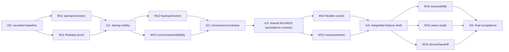

> **Document status:** never executed as written. The M11–M16 branch plan was superseded by the later MVP wrap-up and durability work. Retained as historical context, not as a current description of the app.

> MVP scope update (2026-09-08): [Final MVP implementation plan](mvp-final-implementation-plan.md) is authoritative for remaining work: cycle wrap-up and durable backup/restore. Broader M11–M16 requirements and old handoffs are deferred unless explicitly included there. Historical implementation evidence below remains valid.

# M11–M16 parallel branch delivery plan

**Authority:** [completion-objective-and-delivery-plan.md](completion-objective-and-delivery-plan.md)  
**Purpose:** turn the approved completion plan into branch-safe, independently handoffable work.  
**Status:** planning only; no task or milestone is claimed implemented or accepted.

The older [parallel delivery plan](parallel-delivery-plan.md) remains evidence for M7–M10. It is not the execution plan for M11–M16.

## Answer: what can run in parallel

The safe delivery shape is one integration owner and at most three worker branches. Parallelism happens in four waves:

| Wave | Start gate | Branches that may run together | End gate |
| --- | --- | --- | --- |
| 1 — safety and install proof | G0 baseline | `codex/m11-startup-recovery` + `codex/m11-release-proof` | G1 recoverable-startup gate |
| 2 — recovery and correctness | G1 | `codex/m12-backup-restore` + `codex/m13-correctness-reliability` | G2 recovery/correctness gate |
| 3 — product completion | G3 shared persistence-contract commit | `codex/m14-flexible-cycles` + `codex/m15-measurements` | G4 feature-integration gate |
| 4 — closure evidence | G4 | `codex/m16-accessibility` + `codex/m16-years-scale` + `codex/m16-device-handoff` | G5 final acceptance |

M11 startup safety is a prerequisite for M12 and M13. M12 and M13 may overlap because their shared-screen and export intersections are reserved for the integrator. M14 and M15 may overlap only after the integrator lands one commit containing both ordered persistence contracts and the corresponding archive-compatibility changes. Final M16 acceptance remains serial after all three evidence branches merge.

## Branch plans

Each linked file is written as a standalone handoff. Replace its placeholders with the exact dependency commit, worktree path, assignee, and start date before dispatch.

| Branch | Plan | Main scope |
| --- | --- | --- |
| `codex/completion-integration` | [Integration owner](branch-delivery-plans/00-integration-owner.md) | Gates, shared contracts, merges, shell wiring, final status/evidence |
| `codex/m11-startup-recovery` | [M11 startup and recovery](branch-delivery-plans/01-m11-startup-recovery.md) | M11.1–M11.4 and M11.6 repository work |
| `codex/m11-release-proof` | [M11 early Release proof](branch-delivery-plans/02-m11-release-proof.md) | M11.5 and reusable Release procedure evidence |
| `codex/m12-backup-restore` | [M12 backup and restore](branch-delivery-plans/03-m12-backup-restore.md) | M12.1–M12.5, isolated from shared app shells |
| `codex/m13-correctness-reliability` | [M13 correctness and reliability](branch-delivery-plans/04-m13-correctness-reliability.md) | M13.1–M13.5 except archive adapter wiring |
| `codex/m14-flexible-cycles` | [M14 flexible cycles](branch-delivery-plans/05-m14-flexible-cycles.md) | Cycle repository/domain/setup/edit/consumer work |
| `codex/m15-measurements` | [M15 measurements](branch-delivery-plans/06-m15-measurements.md) | Measurement repository/domain/routes/components |
| `codex/m16-accessibility` | [M16 accessibility](branch-delivery-plans/07-m16-accessibility.md) | M16.3 and focused device evidence |
| `codex/m16-years-scale` | [M16 years-scale verification](branch-delivery-plans/08-m16-years-scale.md) | M16.4 fixture, measurement, justified query work |
| `codex/m16-device-handoff` | [M16 Release, recovery, and handoff](branch-delivery-plans/09-m16-device-handoff.md) | M16.1, M16.2, M16.5, M16.6 evidence/runbooks |

## Gate definitions

### G0 — reproducible baseline

- Reconcile and commit the intended current working-tree changes; never reset or auto-stash them.
- Record the integration commit and environment versions.
- Run `npx jest --runInBand`, `npm run typecheck`, and available installed Expo diagnostics.
- Record failures as product, fixture/clock, or environment failures without manufacturing a green baseline.
- Create worker branches from this exact commit.

### G1 — recoverable startup

- M11 automated acceptance passes for fresh and V1–V6 fixtures, future schema refusal, injected failures, retry, snapshots, and overlapping writes.
- Startup exposes ready, recoverable-error, and incompatible-data states without an endless loader or destructive reset default.
- The prior database or last known-good state remains recoverable after failed upgrade work.
- The early standalone Release result is recorded as passed or explicitly pending; pending device access does not block Wave 2 repository work.

### G2 — recovery/correctness integration

- M12 and M13 diffs are merged and their intersecting tests pass together.
- Restore can quiesce writes through the M11 coordinator and reopen/refresh consumers.
- The backup format, raw-table inventory, shared week evaluator, temporal write rules, and reminder reconciliation contract are frozen.
- The integrator wires Settings/startup recovery and the readable-export evaluator adapter.
- No new schema ships until old/new backup and migration compatibility is green.

### G3 — shared M14/M15 persistence contract

This is a serial integration-owner commit, not a third feature branch. It must:

- allocate the next two migration versions in order without rewriting V1–V6;
- add the cycle plan/actual-closure representation and the two-kind measurement identity/revision representation;
- preserve legacy cycle meaning and all existing foreign keys/index invariants;
- update backup inventory, validation, data dictionary, and old/new round-trip fixtures for both schemas;
- freeze repository-facing types and the Home/Settings/root-route integration interfaces; and
- pass migration, backup, and typecheck gates before either feature branch starts.

The exact migration numbers are chosen from the integration branch at G3. Plans must not assume that the next version is V7.

### G4 — feature integration

- M14 and M15 merge without either branch editing shared migration/archive infrastructure.
- The integration owner alone wires root routes plus the shared Home and Settings surfaces.
- Cross-feature tests prove measurements in empty/active/completed cycle states and cycle actions with measurement data present.
- Full Jest/typecheck and all migration/archive round trips pass.

### G5 — final acceptance

- The three M16 evidence branches are merged, then the final device/recovery matrix is rerun against one identified integration build.
- `docs/project-overview.md`, `docs/milestones.md`, `docs/release-checklist.md`, data/recovery/maintenance references, and dated acceptance evidence agree.
- Device-unverified rows remain pending; only section 10 of the authority document can close mandatory delivery.

## Shared-file serialization

| Area | Owner and timing |
| --- | --- |
| `src/db/schema.ts`, `src/db/migrations.ts`, migration numbers | M11 owner in Wave 1 if needed; integration owner at G3; M16 performance owner only if explicitly assigned a measured index migration |
| Snapshot/write-coordination primitives | M11 owner, then M12 consumer; later edits require integration-owner assignment |
| Backup inventory, validation, manifest, data dictionary | M12 owner in Wave 2; integration owner at G3 and feature integration |
| `app/_layout.tsx` and root recovery boundary | M11 owner in Wave 1; integration owner thereafter |
| `app/(tabs)/index.tsx`, `app/(tabs)/settings/index.tsx`, tab/root route registration | M13 owner in Wave 2; integration owner at G2/G4; M16 accessibility owner after G4 |
| Readable-export week semantics | M13 supplies the evaluator; M12 supplies the exporter; integrator joins them at G2 |
| M14/M15 shared schema and export integration | Integration owner only at G3/G4 |
| `docs/project-overview.md`, `docs/milestones.md`, `docs/release-checklist.md`, consolidated progress/acceptance status | Integration owner only |

## Universal worker rules

1. Start from the exact dependency commit in the branch plan, not from stale `main`.
2. Inspect the working tree and current implementation before changing code. Reproduce assigned findings; do not duplicate fixes already present.
3. Edit only owned files. For a necessary out-of-scope change, stop and send the integrator the smallest requested interface or patch description.
4. Never allocate a migration number, change the archive format, add a dependency, or edit shared shell/status docs unless the branch explicitly owns that action.
5. Keep commits scoped. Do not perform broad formatting, dependency upgrades, resets, or generated native-project churn.
6. Run focused tests and typecheck. Record exact commands and results; distinguish automated, simulator, and physical-device evidence.
7. Do not mark a milestone accepted. Report one of: `implemented — device checks pending`, `implemented and branch checks passed`, or `blocked` with a reproducible reason.
8. Hand off commits, changed files, behavior, tests, risks, archive/migration implications, and exact pending device steps.

## Merge order

1. Merge `m11-startup-recovery`; integrate any `m11-release-proof` config/evidence without weakening startup recovery.
2. Merge M12 core, then M13, then perform the G2 adapter/shell commit. If M13 must land first for a shared evaluator, cherry-pick only that evaluator commit before M12 and retain the same final gate.
3. Land G3 on the integration branch.
4. Merge M14 and M15 in either order because both start from G3 and avoid shared infrastructure; perform G4 shell wiring afterward.
5. Merge M16 performance, accessibility, and device/runbook work in the least-conflicting order, then run one final integrated acceptance pass.

