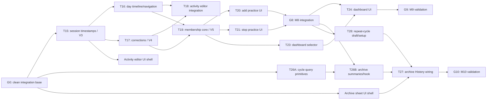

> **Document status:** implemented and superseded. This was the M7–M10 branch plan. Retained as historical context, not as a current description of the app.

# M7–M10 parallel delivery plan

This plan turns Tasks 15–29 in `docs/implementation-plan.md` into short-lived,
independent branches for sub-agents. It supplements the task descriptions with
dependency gates, file ownership, and merge order. If a broad task file list
conflicts with the narrower ownership below, this document controls during
multi-agent execution.

## Capacity and answer

- The environment supports one integration owner plus at most **three active sub-agents**.
- The safe maximum is therefore **three concurrent worktree branches**.
- Early M7 has only **two complete tasks** that can run in parallel; a third agent can own an isolated presentational component.
- After the membership foundation lands, **three complete branches** can run concurrently.
- M9 and M10 are the two full feature lanes that can proceed independently after M8's data contract is merged.
- M7, M8, M9, and M10 cannot all be implemented independently from today's `main`: effective sessions and membership semantics are prerequisites for truthful dashboard and archive results.

The expected operating shape is two or three workers plus one integrator—not four independent milestone branches.

## Dependency graph



## Branch and worktree rules

1. The root agent owns `codex/m7-m10-integration`, merges, roadmap/status docs, cross-feature tests, and device-check coordination.
2. Every worker receives a short-lived `codex/` branch in a separate git worktree. Agents must never share the current checkout.
3. Branches start from the exact integration commit containing all prerequisite gates—not from stale `main`.
4. Feature agents edit only their owned files, add focused tests, and create one or a few scoped commits. They do not edit `docs/milestones.md`, `docs/project-overview.md`, `docs/release-checklist.md`, or `progress/`.
5. The integrator reviews each branch, applies its commits to the integration branch, runs intersection tests plus `tsc`, and only then advances the dependency gate.
6. Only one active branch owns `src/db/schema.ts`, `src/db/migrations.ts`, or shared domain types at a time. Migration order is fixed: V3 → V4 → V5.
7. Full Jest, TypeScript, Expo Doctor, and device validation run at milestone gates; worker branches run the focused commands in their task brief.

Example worktree creation after the integration base is clean and committed:

```bash
git worktree add /private/tmp/hexis-t15 -b codex/m7-t15-session-time codex/m7-m10-integration
```

Each sub-agent prompt must include the worktree path, branch name, dependency
commit, owned files, forbidden shared files, expected tests, and required commit
message.

## Preflight gate G0

Before implementation branches exist:

- Reconcile and commit the intended roadmap changes.
- Decide which current `app.json`, `package.json`, asset, plugin, and tool-config changes belong in the shared base; do not auto-stash or discard them.
- Create `codex/m7-m10-integration` from the approved base.
- Run `npx jest --runInBand` and `npx tsc --noEmit` once and record the baseline.
- Freeze the session and History route contracts below.

## Contracts frozen before parallel work

### Effective sessions

- `SessionLog.startedAt` is an ISO instant.
- `localDate` is derived from that same instant in the device timezone.
- A corrected session retains the immutable base session id.
- Normal `listForCycle` and `listForDay` calls return only the latest non-tombstoned effective state.
- Raw originals/revisions are available only through explicitly audit-named APIs.
- Revision writes contain a complete replacement snapshot; a tombstone is the only delete mechanism.
- Historical creation/edit input carries `startedAt`; callers do not independently choose a conflicting `localDate`.

### Day navigation

- `/history?filter=day&date=YYYY-MM-DD` is canonical.
- `CycleCalendar` exposes `onSelectDay(localDate)` and a maximum interactive date.
- Future and outside-cycle dates never navigate.

### Goal membership

- `activeFromDate` is inclusive; `inactiveFromDate` is exclusive.
- `isGoalActiveOn(goal, date)` is the only day-membership predicate.
- `goalMembershipForWeek(...)` returns `full`, `partial`, or `inactive` using only the in-cycle days of that calendar week.
- `listForCycle` returns every historical goal; `listActiveForCycle(cycleId, date)` returns current membership.
- Repository operations, not UI alone, enforce the last-active-goal guard and inactive-date logging/correction rules.
- Existing sessions on a same-day stop boundary remain readable and correctable in place; new sessions cannot be added to the stopped goal.

### Dashboard and repeat-cycle inputs

- `HomeDashboardSummary` is frozen before dashboard UI integration begins.
- Presentational dashboard components receive plain props and do not query SQLite.
- `buildRepeatCycleDraft` returns new setup input only; it never writes or reuses ids.
- The History owner performs the final Repeat-cycle button wiring after archive and setup branches merge.

## Delivery waves

### Wave 1 — independent foundation/scaffolding

Up to three agents from G0:

| Branch | Scope | Owns | Must not touch |
| --- | --- | --- | --- |
| `codex/m7-t15-session-time` | Task 15, V3 and `startedAt` | schema/migrations, session types/repository/logging call sites, dedicated migration/repository tests | cycle archive, History layout |
| `codex/m10-t26a-cycle-queries` | `getCycleById`, `listCycles`, deterministic ordering | `cycleRepository.ts` and focused repository assertions | `useCycleHistory`, archive summaries, schema |
| `codex/m10-archive-sheet-shell` | Pure archive selector component with fixture tests | new `CycleArchiveSheet.tsx` and isolated component test | `history.tsx`, hooks, repositories |

Task 15 is the critical path. The two M10 branches may merge early because they
contain no assumptions about effective sessions or membership summaries.

### Wave 2 — M7 diamond

After Task 15 merges, three agents may run:

| Branch | Scope | Exclusive ownership |
| --- | --- | --- |
| `codex/m7-t16-day-history` | Task 16 | `CycleCalendar.tsx`, `cycleSummary.ts`, `useCycleHistory.ts`, Home/History calendar wiring, day/navigation tests |
| `codex/m7-t17-session-corrections` | Task 17, V4 | schema/migrations, `sessionRepository.ts`, correction/audit types, migration and repository tests |
| `codex/m7-t18a-activity-editor-ui` | Presentational portion of Task 18 | new `ActivityEditorSheet.tsx` plus callback-driven component tests only |

Task 17 must not rewrite `cycleSummary.ts` or `historyInsights.ts`; effective
repository reads are the boundary. Merge Task 17 first, Task 16 second, and the
isolated editor component third. Then run their intersection tests.

### Wave 3 — M7 integration plus membership foundation

After Tasks 16 and 17 are combined:

| Branch | Scope | Notes |
| --- | --- | --- |
| `codex/m7-t18b-activity-editor-integration` | Wire add/edit/delete into History and effective repository mutations | Owns `history.tsx`, mutation hook, History interaction tests |
| `codex/m8-t19-membership-core` | Task 19, V5, no UI | Owns schema/migrations, goal/cycle/session repositories, membership helpers/selectors, factories and persistence/domain tests |
| `codex/m9-dashboard-ui-shell` | Pure `WeekAtGlanceCard` and `RecentRhythm` components | Fixture/callback props only; no Home/hook changes |

M7 integration and M8 persistence can proceed together because the latter does
not own History UI. M8 may not pass its milestone gate until M7 integration is
green.

### Wave 4 — three branches after membership core

After Task 19 merges and its contract is frozen:

| Branch | Scope | Exclusive ownership |
| --- | --- | --- |
| `codex/m8-t20-add-practice` | Task 20 | add-goal route, Stack registration, Settings add action, form reuse, `addGoalMembership.test.tsx` |
| `codex/m8-t21-stop-practice` | Task 21 | edit-goal stop confirmation/guard UX, `stopGoalMembership.test.tsx` |
| `codex/m9-t23-dashboard-domain` | Pure Task 23 selector | `homeDashboard.ts`, domain tests, frozen `HomeDashboardSummary`; no Home screen/hook yet |

Task 19 owns all membership repository APIs. Tasks 20 and 21 consume them and
must not edit `goalRepository.ts`. Task 20 owns Settings; Task 21 must not edit
Settings. Separate test files avoid textual conflicts.

The integrator merges Add, then Stop, then owns the small M8 hook/filter adapter,
cross-screen integration test, full suite, device boundary check, and Task 22 docs.

### Wave 5 — dashboard and archive/repeat lanes

After the M8 integration gate:

| Branch | Scope | Exclusive ownership |
| --- | --- | --- |
| `codex/m9-t24-dashboard-ui` | Adapt `useCycleLanding`, wire the frozen dashboard model into Home and the prebuilt components | Home screen, GoalRow/CycleHeader, dashboard component/accessibility tests |
| `codex/m10-t26b-archive-summary` | Membership-aware archive summaries and selected-cycle hook | `cycleArchive.ts`, `useCycleHistory.ts`, archive domain/hook tests |
| `codex/m10-t28-repeat-setup` | Repeat-cycle draft and setup prefill | `repeatCycleDraft.ts`, setup provider/routes, domain/setup tests; no History edits |

M9 and M10 are now genuinely independent. Dashboard work owns Home; archive work
owns History/domain; repeat work owns setup.

### Wave 6 — final integration and validation

1. Merge Task 26B and the earlier archive component.
2. Run `codex/m10-t27-archive-history`, which alone owns final `history.tsx` cycle-selection wiring.
3. Merge Task 28 and let the History owner/integrator add the Repeat-cycle action.
4. While M10 wiring runs, the integrator may finish Task 25's M9 suite/device/docs gate.
5. Run Task 29 full suite, TypeScript, Expo Doctor, multi-cycle device scenario, and roadmap/progress updates.

Validation and roadmap commits stay serial on the integration branch so agents do
not race over `project-overview.md`, `release-checklist.md`, or the same progress
log.

## Shared-file ownership

| Shared area | Sole owner at a time |
| --- | --- |
| `schema.ts`, `migrations.ts`, shared domain types | Current migration/core branch: T15, then T17, then T19 |
| `cycleSummary.ts` and its tests | T16 during M7; T19 during membership integration |
| `useCycleHistory.ts` | T16, then T18 integration, then T26B/T27 |
| `app/(tabs)/history.tsx` | T16, then T18 integration, then T27 |
| `goalRepository.ts` | T19; later UI branches consume its API |
| `app/(tabs)/settings/index.tsx` | T20 |
| `useCycleLanding.ts` | M8 integrator, then T24 dashboard adapter |
| `app/(tabs)/index.tsx`, `GoalRow.tsx`, `CycleHeader.tsx` | T24 |
| setup provider/routes | T28 |
| milestone, overview, checklist, progress docs | Root/integration owner only |

## Merge checklist for every worker branch

- Branch contains only owned files and focused tests.
- No unrelated formatting or dependency churn.
- Worker reports exact commands/results and commits its work.
- Integrator reads the diff, verifies the frozen contract, and checks for user-owned changes.
- Integrator applies the commit(s), runs intersection tests and `npx tsc --noEmit`.
- Full Jest and Expo Doctor run only at the defined gates unless risk warrants an earlier run.
- Worktree is removed only after its commits are safely present on the integration branch.

## Critical path

The shortest path to visible progress is:

`T15 → (T16 + T17) → T18 → T19 → (T20 + T21 + T23) → M8 integration → (T24 + T26B + T28) → T27`.

Early T26A and archive-component work reduce M10 latency, but they do not move a
milestone gate. The migration/core branches remain the pacing work.
