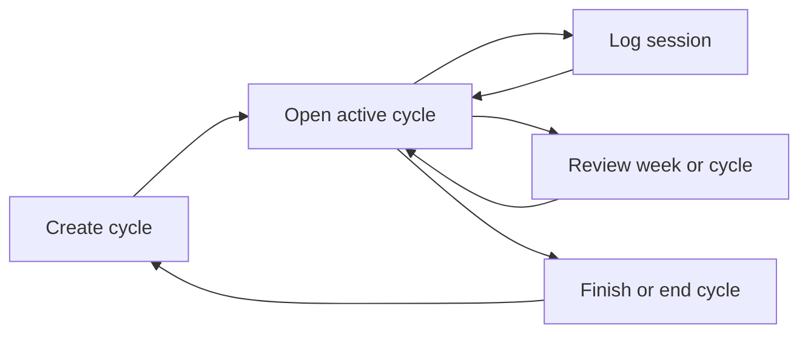

# Hexis

## Product summary

Hexis is a calm, local-first iPhone app for building consistency through finite focus cycles. Instead of maintaining an endless, growing list of habits, a person commits to a deliberately small group of practices for a defined period: 30 days by default, with 60- and 90-day options.

The app makes real effort visible without making logging feel like administration. A person opens the active cycle, sees its progress at a glance, and logs a session directly from the habit list.

## The problem

People with several interests often lose momentum not because they lack goals, but because their tracking system is either too vague or too demanding. A useful tracker must:

- Support different kinds of practice: a daily 30-minute reading habit and three weekly one-hour strength sessions are both valid.
- Make the common action quick: logging should take one tap plus an optional quick duration choice.
- Provide enough visual history to sustain motivation without becoming a performance dashboard.
- Avoid turning every missed day into an overdue task.

## Product principles

1. **Finite commitments over endless lists.** Every active group of habits belongs to a 30-, 60-, or 90-day cycle.
2. **Log effort, not intentions.** A log represents a session that occurred and records its actual duration when relevant.
3. **One calm home.** The active cycle landing page is the default destination.
4. **Quiet motivation.** Streaks, contribution-style calendar marks, and progress bars communicate momentum without scores, ranks, or guilt.
5. **Local by default.** Version one works fully offline and does not require an account.
6. **Minimal visual language.** Porcelain & Ink uses open warm-neutral surfaces, ink-like typography, and a single muted verdigris progress signal. Glass is reserved for elevated controls and confirmation surfaces.

## Primary audience

Hexis is initially designed for a single person tracking a handful of meaningful practices, such as:

- Strength training: 3 sessions per week, about 60 minutes each
- Swimming: 2 sessions per week, about 60 minutes each
- Yoga: 1 session per week
- Reading: 30 minutes every day
- Guitar practice, sport, creative work, or regular posting

The product remains useful when a practice has only a count target, only a duration target, or both.

## Core concept: the cycle

A cycle is a named, time-bounded commitment with:

- A length of 30 days by default, or 60 or 90 days
- A start date and calculated end date
- A small selected set of practices
- Immutable historical session logs

The selected practice group is captured when the cycle begins. Version one does not add or remove practices mid-cycle. If the group itself needs to change, the person ends the cycle early and starts a new one. This preserves an understandable historical record.

An active practice may still be updated. A returning user can edit its name, target frequency, or expected duration; the update takes effect from that local day forward. Earlier logs and their historical progress remain associated with the configuration that was active when they were recorded.

## Core loop

1. Create a 30-, 60-, or 90-day cycle.
2. Select starter templates or create custom practices and configure their targets.
3. Review the complete commitment and start the cycle.
4. Open the landing page to see `Day X / duration`, the contribution calendar, and every configured practice.
5. Tap **Log** for the practice that was completed, choose a quick duration when relevant, and save.
6. Review a compact weekly summary or cycle-complete summary.

## First-time onboarding

The first-run flow should stay short and deliberately progressive:

1. **Welcome:** explain the idea of a finite focus cycle.
2. **Cycle length:** choose 30 days by default, or 60/90 days.
3. **Practice selection:** start with editable templates or add a custom practice.
4. **Practice configuration:** set a weekly/daily frequency and expected duration.
5. **Review and start:** show the entire group and duration together before creating the cycle.

The UI should not ask for notification permission during onboarding. Request it only when the person actively enables the single app-level daily reminder.

## Active cycle landing page

The landing page replaces a traditional “today” checklist. It contains:

1. **Cycle header:** cycle name, `Day X / duration`, days remaining, and one thin overall progress line.
2. **Cycle calendar:** a compact contribution-style grid with one mark per day. Mark size or intensity reflects how many practices were logged that day; the current day is visually identified.
3. **Unified practice list:** no “due today” versus “other” grouping.
4. **Practice rows:** habit name, streak, weekly progress bar and target total, and a direct **Log** action.

This model avoids falsely marking flexible weekly practices as overdue while keeping every configured practice visible.

## Logging flow

The direct action is always **Log**, not a generic checkbox.

1. Tap **Log** beside a practice.
2. A compact sheet opens with quick duration choices: 15, 30, 45, 60, or 90 minutes.
3. Select the actual duration or accept the relevant default.
4. Save the session.
5. Return to the landing page with refreshed progress, calendar intensity, and streak.

Practices without a duration target may still log a session with no duration. The app should never require an in-app timer.

## Progress and insights

### Per-practice

- Current streak
- Current week’s completed sessions versus target
- Current week’s logged minutes versus expected minutes when applicable

### Weekly review

The weekly review stays compact:

- Sessions completed
- Time logged
- Target progress by practice
- Strongest day
- Practices that did not reach their weekly target

It must describe the observed pattern, not make adaptive recommendations.

### Cycle review

At completion or early exit, show:

- Total active days and days with logged effort
- Practice-level completion and duration totals
- The contribution calendar for the cycle
- The strongest week and most consistent practice

## Data model

| Entity | Purpose | Key fields |
| --- | --- | --- |
| `Cycle` | A bounded focus period | id, name, startDate, durationDays, endDate, status |
| `CycleGoal` | A practice captured in a cycle | id, cycleId, name, cadence, weeklyTargetCount, expectedDurationMinutes |
| `GoalRevision` | A forward-only update to a cycle goal | id, cycleGoalId, effectiveDate, changed target/configuration fields |
| `SessionLog` | An immutable completed session | id, cycleGoalId, localDate, startedAt, durationMinutes, createdAt |
| `ReminderSettings` | Optional app-level local reminder | enabled, localTime, notificationIdentifier |

Progress is derived from logs and effective goal configuration. It is not stored as a duplicate aggregate.

## Technical direction

| Area | Decision |
| --- | --- |
| Platform | iPhone-first, iOS 26+ visual target |
| Framework | Expo with React Native and TypeScript |
| Navigation | Expo Router |
| Persistence | `expo-sqlite`, versioned migrations, offline-first |
| Notifications | `expo-notifications`, one optional app-level local reminder |
| Native glass | `expo-glass-effect` for selective native Liquid Glass surfaces |
| State | Feature-local hooks and repositories; SQLite remains the source of truth |
| Styling | React Native `StyleSheet` plus a small token system; no utility-class dependency |
| Testing | Jest with `jest-expo`, React Native Testing Library, and deterministic repository tests |

`expo-glass-effect` is available on iOS 26 and later and renders a normal `View` fallback on unsupported environments. Hexis should use it sparingly so content remains readable and the design does not depend on glass to communicate state.

## Visual direction: Porcelain & Ink

- **Surface:** warm porcelain-like open space, with no decorative gradients.
- **Typography:** high-contrast, ink-like hierarchy using native typography.
- **Accent:** muted verdigris for completion, progress, and calendar intensity.
- **Glass:** tab/navigation surfaces, logging sheet, and elevated confirmation controls only.
- **Motion:** subtle completion feedback; respect reduced-motion settings.
- **Accessibility:** Dynamic Type, VoiceOver labels for all progress and controls, non-color progress labels, and sufficient text contrast over translucent surfaces.

## Version-one scope

Included:

- 30/60/90-day cycles
- Editable templates and custom practices before cycle start
- Daily and weekly count/duration targets
- Direct session logging with quick duration choices
- Unified practice list, streaks, weekly progress, and active-cycle calendar
- Weekly and cycle-complete summaries
- Returning-user forward-only goal edits
- One optional app-level daily reminder
- Local SQLite persistence

Explicitly excluded:

- Accounts, sign-in, and cloud sync
- Widgets, Apple Watch, Apple Health, or HealthKit
- Per-practice reminders
- In-app timers
- Social sharing, leaderboards, and challenges
- AI coaching or adaptive recommendations
- Payments, subscriptions, and web/Android versions

## Success criteria

Hexis succeeds when a person can:

1. Start a default 30-day cycle in under two minutes.
2. Log a session from the landing page in under five seconds after opening the app.
3. Understand active-cycle progress without navigating away from the landing page.
4. See reliable weekly and cycle history even after modifying a practice.
5. Use the entire app offline, without creating an account.
