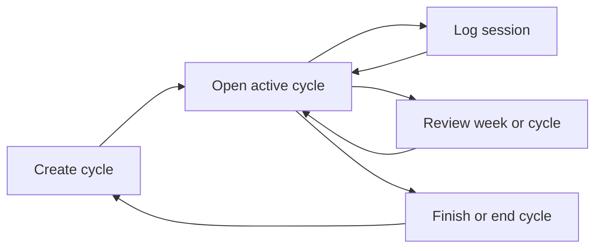

# Hexis

## Product summary

Hexis is a calm, local-first iPhone app for building consistency through finite focus cycles. Instead of maintaining an endless, growing list of habits, a person commits to a deliberately small group of practices for a defined period: 30 days by default, with 60- and 90-day options.

The app makes real effort visible without making logging feel like administration. A person opens the active cycle, sees its progress at a glance, and logs a session directly from the habit list.

## The problem

People with several interests often lose momentum not because they lack goals, but because their tracking system is either too vague or too demanding. A useful tracker must:

- Support different kinds of practice: a daily 30-minute reading habit and three weekly one-hour strength sessions are both valid.
- Make the common action quick: logging should take one tap plus an optional quick duration choice.
- Provide enough visual history to sustain motivation without becoming a performance dashboard.
- Avoid turning every missed day into an overdue task.

## Product principles

1. **Finite commitments over endless lists.** Every active group of habits belongs to a 30-, 60-, or 90-day cycle.
2. **Log effort, not intentions.** A log represents a session that occurred and records its actual duration when relevant.
3. **One calm home, a few quiet peers.** Home (the active cycle landing page) is the default tab and primary destination; History and Settings are lightweight peer tabs for everything else. Focused tasks — starting a cycle, editing a goal — present as full-screen modals rather than adding to the tab set, so the destination set stays small and flat.
4. **Quiet motivation.** Streaks, contribution-style calendar marks, and progress bars communicate momentum without scores, ranks, or guilt.
5. **Local by default.** Version one works fully offline and does not require an account.
6. **Minimal visual language.** Porcelain & Ink uses open warm-neutral surfaces, ink-like typography, and a single muted verdigris progress signal. Glass is reserved for elevated controls and confirmation surfaces.

## Primary audience

Hexis is initially designed for a single person tracking a handful of meaningful practices, such as:

- Strength training: 3 sessions per week, about 60 minutes each
- Swimming: 2 sessions per week, about 60 minutes each
- Yoga: 1 session per week
- Reading: 30 minutes every day
- Guitar practice, sport, creative work, or regular posting

The product remains useful when a practice has only a count target, only a duration target, or both.

## Core concept: the cycle

A cycle is a named, time-bounded commitment with:

- A length of 30 days by default, or 60 or 90 days
- A start date and calculated end date
- A small selected set of practices
- Immutable historical session logs

The initial practice group is captured when the cycle begins, but it may evolve without rewriting the past. A person can add a practice or stop tracking one during an active cycle; both changes take effect on the current local date. Every practice keeps inclusive `activeFromDate` and exclusive `inactiveFromDate` boundaries, so earlier days, targets, and logs retain their original membership context. At least one practice must remain active until the cycle ends.

An active practice may still be updated. A returning user can edit its name, target frequency, or expected duration; the update takes effect from that local day forward. Earlier logs and their historical progress remain associated with the configuration that was active when they were recorded.

## Core loop

1. Create a 30-, 60-, or 90-day cycle.
2. Select starter templates or create custom practices and configure their targets.
3. Review the complete commitment and start the cycle.
4. Open the landing page to see `Day X / duration`, the contribution calendar, and every configured practice.
5. Tap **Log** for the practice that was completed, choose a quick duration when relevant, and save.
6. Use Home to see what remains this week and the recent seven-day rhythm.
7. Review any cycle by day, week, or cycle, and optionally use a finished cycle to prefill the next setup flow.

## First-time onboarding

The first-run flow should stay short and deliberately progressive:

1. **Welcome:** explain the idea of a finite focus cycle.
2. **Cycle length:** choose 30 days by default, or 60/90 days.
3. **Practice selection:** start with editable templates or add a custom practice.
4. **Practice configuration:** set a weekly/daily frequency and expected duration.
5. **Review and start:** show the entire group and duration together before creating the cycle.

The UI should not ask for notification permission during onboarding. Request it only when the person actively enables the single app-level daily reminder.

## Navigation model

Hexis uses a persistent bottom tab bar with three tabs: **Home**, **History**, and **Settings**. Tabs are always visible, whether or not a cycle is active.

- **Home** shows the active-cycle landing page; once the active cycle completes (naturally, or ended early) and no new cycle has replaced it, Home instead shows an achievement summary with a **Start a new cycle** action; a person who has never started a cycle sees a plain empty state with a **Start a cycle** action.
- **History** reviews progress through a Day / Week / Cycle filter (see "Progress and insights" below). Its cycle selector can browse the active cycle and every completed or early-ended cycle without changing which cycle is active.
- **Settings** consolidates adding, editing, or stopping active practices; the daily reminder (a toggle plus a time picker once enabled); and ending the current cycle early.

Two flows are focused tasks rather than destinations, so they do not get their own tab: **cycle setup** (duration → practices → review) and **editing a goal**. Both present as a full-screen modal on top of the tab bar, with the tab bar hidden until the flow is dismissed. Within a modal, each step is a real navigation entry with a native header back button and the standard iOS edge-swipe-back gesture — a person can always retreat to the previous step or screen without losing entered data.

## Active cycle landing page

The landing page replaces a traditional “today” checklist. Its hierarchy answers the most useful questions first:

1. **Cycle header:** cycle name, `Day X / duration`, and days remaining.
2. **This week:** sessions and minutes logged, eligible targets and remaining effort, and calendar days left in the bounded week.
3. **Recent rhythm:** seven local-day buckets plus a neutral session-count comparison with the preceding week.
4. **Unified practice list:** stable user order, explicit remaining progress, current streak, and a direct **Log** action. A partial-membership week shows raw effort but is labelled instead of scored.
5. **Cycle calendar:** secondary cycle context with one contribution mark per day. Past and current days open that date's History Day progress; future days remain unavailable.

This model avoids falsely marking flexible weekly practices as overdue while keeping every configured practice visible.

## Logging flow

The direct action is always **Log**, not a generic checkbox.

1. Tap **Log** beside a practice to save a session immediately with its expected duration (or no duration for a count-only practice).
2. Tap **Details** instead to choose a quick duration before saving.
3. A live session records the actual current time at save.
4. History Day can add an activity at an earlier date/time or edit/delete an existing activity. These operations append correction records; they never overwrite or physically remove the base log.
5. Return to Home with weekly metrics, recent rhythm, calendar intensity, and streak refreshed from effective session state.

Practices without a duration target may still log a session with no duration. The app should never require an in-app timer.

## Progress and insights

### Per-practice

- Current streak
- Current week’s completed sessions versus target
- Current week’s logged minutes versus expected minutes when applicable

### History: Day filter

For a selected local date, shows total sessions and minutes, a chronological activity timeline, and every practice that participated on that date. Bounded Previous/Next controls move within the selected cycle. Timeline rows can be corrected or deleted, and **Add activity** can backfill a valid elapsed date. Practice choices follow membership on the editor's date; an existing same-day session remains correctable after its practice is stopped.

### History: Week filter

Weeks are calendar weeks (Monday–Sunday) — the same definition already used for per-practice weekly targets and streaks above, so a week means the same thing everywhere in the app. Defaults to the current week; a person can navigate to any earlier week within the active cycle. Each week stays compact and visual:

- Sessions completed, time logged, and practices that reached their target
- A seven-day activity rhythm chart
- Session-count movement versus the preceding week
- Target and planned-time progress by practice
- The week's strongest day

It must describe the observed pattern, not make adaptive recommendations.

### History: Cycle filter

Shows the full-cycle contribution grid alongside:

- Active-day ratio across elapsed cycle days
- Total sessions, logged time, and current/longest active-day runs
- A recent six-week session trend (or the full trend when fewer weeks exist)
- Target-normalized consistency and cadence-aware streaks by practice

The metrics remain descriptive rather than evaluative: target progress is capped at 100%, over-target sessions still remain in the raw totals, and the interface does not assign a score or recommendation. History refreshes from SQLite whenever the tab regains focus so a newly logged session appears immediately.

## Data model

| Entity | Purpose | Key fields |
| --- | --- | --- |
| `Cycle` | A bounded focus period | id, name, startDate, durationDays, endDate, status |
| `CycleGoal` | A dated practice membership captured in a cycle | id, cycleId, name, cadence, weeklyTargetCount, expectedDurationMinutes, activeFromDate, inactiveFromDate |
| `GoalRevision` | A forward-only update to a cycle goal | id, cycleGoalId, effectiveDate, changed target/configuration fields |
| `SessionLog` | An immutable base completed session | id, cycleGoalId, localDate, startedAt, durationMinutes, createdAt |
| `SessionCorrection` | An append-only replacement or tombstone for a base session | id, sessionLogId, replacement fields or deleted marker, createdAt |
| `ReminderSettings` | Optional app-level local reminder | enabled, localTime, notificationIdentifier |

Progress is derived from effective sessions, dated membership, and effective goal configuration. It is not stored as a duplicate aggregate.

A cycle's `status` moves from `active` to `completed` automatically the next time the app reads cycle state after its `endDate` has passed — there is no background job, since Hexis is local-only and only needs to notice on next open.

## Technical direction

| Area | Decision |
| --- | --- |
| Platform | iPhone-first, iOS 26+ visual target |
| Framework | Expo with React Native and TypeScript |
| Navigation | Expo Router: a persistent bottom tab group (Home, History, Settings) plus modal-presented focused flows (cycle setup, goal editing) with native header back and swipe-back |
| Persistence | `expo-sqlite`, versioned migrations, offline-first |
| Notifications | `expo-notifications`, one optional app-level local reminder |
| Native glass | `expo-glass-effect` for selective native Liquid Glass surfaces |
| State | Feature-local hooks and repositories; SQLite remains the source of truth |
| Styling | React Native `StyleSheet` plus a small token system; no utility-class dependency |
| Testing | Jest with `jest-expo`, React Native Testing Library, and deterministic repository tests |

`expo-glass-effect` is available on iOS 26 and later and renders a normal `View` fallback on unsupported environments. Hexis should use it sparingly so content remains readable and the design does not depend on glass to communicate state.

## Visual direction: Porcelain & Ink

- **Surface:** warm porcelain-like open space, with no decorative gradients.
- **Typography:** high-contrast, ink-like hierarchy using native typography.
- **Accent:** muted verdigris for completion, progress, and calendar intensity.
- **Glass:** tab/navigation surfaces, logging sheet, and elevated confirmation controls only.
- **Motion:** subtle completion feedback; respect reduced-motion settings.
- **Accessibility:** Dynamic Type, VoiceOver labels for all progress and controls, non-color progress labels, and sufficient text contrast over translucent surfaces.

## Version-one scope

Included:

- 30/60/90-day cycles
- Persistent bottom tab navigation (Home, History, Settings) with modal-presented setup and goal-editing flows, native back, and swipe-back
- Automatic active-to-completed cycle transition once the end date passes, with a Home completion summary and a **Start a new cycle** action
- Editable templates and custom practices before cycle start
- Forward-only add/stop practice membership during an active cycle
- Daily and weekly count/duration targets
- Direct session logging with quick duration choices
- Historical activity add/edit/delete through append-only corrections
- Weekly remaining effort, recent rhythm, unified practice list, streaks, and cycle calendar
- Day/Week/Cycle progress review across the full cycle archive
- Repeat-cycle setup prefilled from the final active configuration of a completed or early-ended cycle
- Returning-user forward-only goal edits
- One optional app-level daily reminder with a time picker
- Local SQLite persistence

Explicitly excluded:

- Accounts, sign-in, and cloud sync
- Widgets, Apple Watch, Apple Health, or HealthKit
- Per-practice reminders
- In-app timers
- Social sharing, leaderboards, and challenges
- AI coaching or adaptive recommendations
- Payments, subscriptions, and web/Android versions

## Success criteria

Hexis succeeds when a person can:

1. Start a default 30-day cycle in under two minutes.
2. Log a session from the landing page in under five seconds after opening the app.
3. State the sessions and minutes remaining this week and recognize the recent seven-day rhythm without leaving Home.
4. Correct an earlier activity without losing its audit trail.
5. Add or stop a practice without changing prior-day targets or history.
6. Browse and repeat earlier cycles without copying their logs or identifiers.
7. Use the entire app offline, without creating an account.
